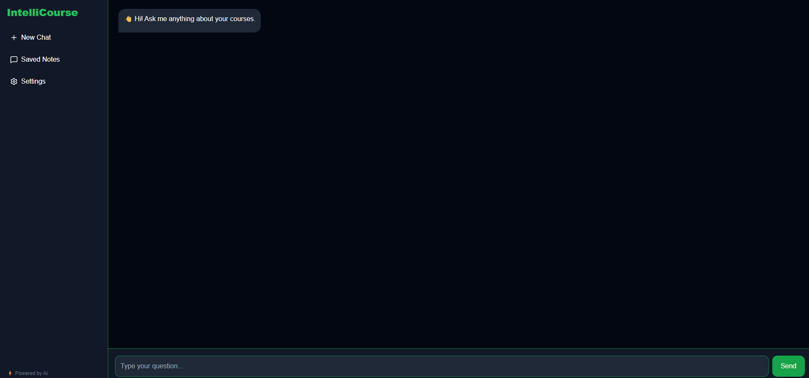
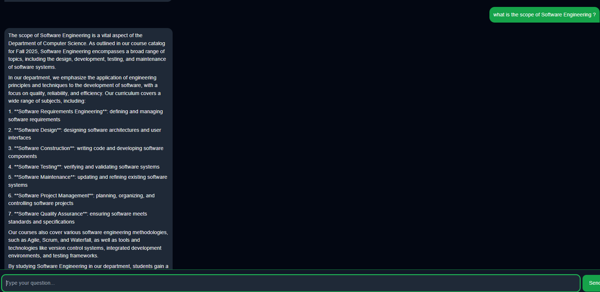

# 📚 Intelligent Course Assistant (FastAPI + LangChain + Groq + Tavily + React)

An AI-powered assistant that answers **course catalog questions** using **RAG (Retrieval-Augmented Generation)** and handles **general queries** via **web search**.
Built with **FastAPI, LangChain, ChromaDB, Groq API, Tavily API (backend)** and **React + TailwindCSS (frontend)**.


##  Features

* **PDF-based Q&A (RAG)** → Ask about prerequisites, credits, or descriptions directly from the catalog.
* **Web Search Integration** → Handles general, real-world questions.
* **Intelligent Routing** → Automatically chooses RAG or web search.
* **FastAPI Backend** → Provides `/chat` and `/ask` endpoints.
* **Vector Database (Chroma)** → Stores course catalog embeddings.
* **Modern Chatbot Frontend** → GPT-style React UI with sidebar & dark theme.


##  Project Structure

```
intelli_course/
│── app/                 # Backend (FastAPI + LangChain)
│   ├── api.py           # API routes
│   ├── agent.py         # AI agent (Groq + Tavily + RAG logic)
│   ├── rag.py           # PDF indexing & retrieval
│   ├── config.py        # API keys & environment config
│
│── scripts/
│   ├── index_pdf.py     # Load & index catalog PDFs
│
│── data/                # Store your course catalog PDFs here
│   ├── CS_Catalog_Fall_2025.pdf
│
│── frontend/            # React + Tailwind chatbot UI
│   ├── src/
│   │   ├── App.jsx      # Chat UI
│   │   ├── main.jsx     # Entry point
│   │   ├── index.css    # Tailwind styles
│   ├── vite.config.js   # Vite config
│   ├── tailwind.config.js
│   ├── package.json
│
│── main.py              # FastAPI entry point
│── requirements.txt     # Python dependencies
│── README.md            # Documentation (this file)
```

---

##  Setup Instructions

### 1️ Clone & Install

```bash
git clone https://github.com/your-repo/intelli_course.git
cd intelli_course
```

---

### 2 Backend Setup (FastAPI)

```bash
python -m venv venv
venv\Scripts\activate   # (Windows)
pip install -r requirements.txt
```

Create a `.env` file:

```
GROQ_API_KEY=your_groq_api_key_here
TAVILY_API_KEY=your_tavily_api_key_here
```

Index the PDFs:

```bash
python -m scripts.index_pdf
```

Run the backend:

```bash
uvicorn main:app --reload
```

API runs at → `http://127.0.0.1:8000`
Swagger Docs → `http://127.0.0.1:8000/docs`

---

### 3 Frontend Setup (React + Tailwind)

```bash
cd frontend
npm install
```

Run the frontend:

```bash
npm run dev
```

App runs at → `http://localhost:5173/`

---

## 4 API Endpoints

### **POST /ask**

For PDF-based queries.

```json
{ "query": "What are the prerequisites for Data Mining?" }
```

### **POST /chat**

For general or mixed queries.

```json
{ "query": "What is the job market like for data scientists?" }
```

Response:

```json
{
  "answer": "Data scientists are in high demand...",
  "source_tool": "rag"   // or "web"
}
```

---

## 5 Screenshots

### Chatbot UI





---

##  Demo Flow

1. Ask: *“What are the prerequisites for Data Mining?”*
   → Answer retrieved from catalog (RAG).

2. Ask: *“What is the job market like for data scientists?”*
   → Answer retrieved from web search.

3. Ask: *“Compare prerequisites of Data Mining and Machine Learning.”*
   → Bot combines multiple RAG results.

---

##  Tech Stack

* **Backend**: FastAPI, LangChain, ChromaDB
* **LLM**: Groq (LLaMA 3.1)
* **Web Search**: Tavily API
* **Frontend**: React, TailwindCSS, Vite
* **UI Extras**: Framer Motion, Lucide Icons

---

##  Future Improvements

* Add chat history persistence.
* “New Chat” reset button.
* Support multiple PDFs.
* Export answers.


